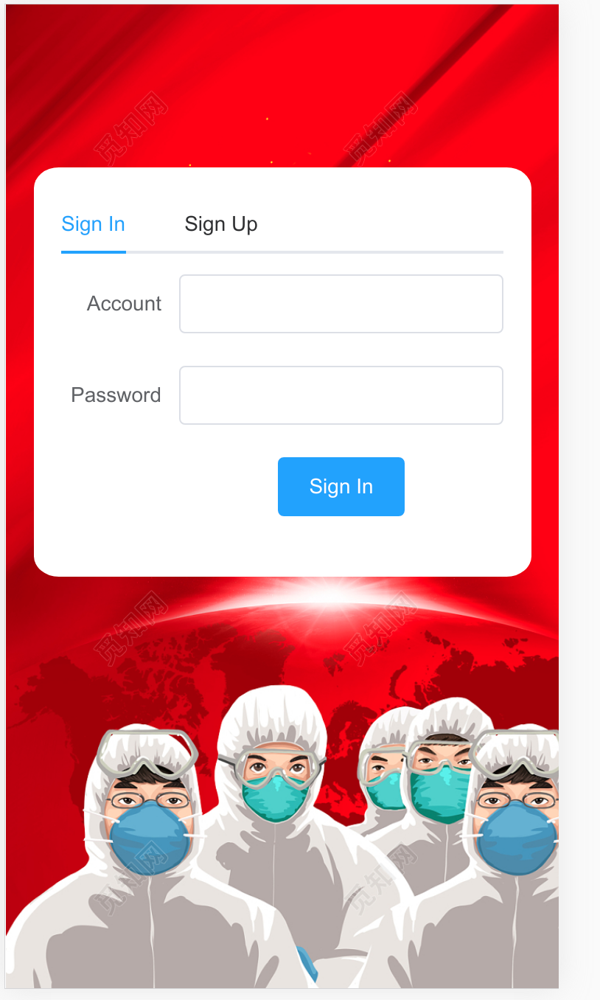
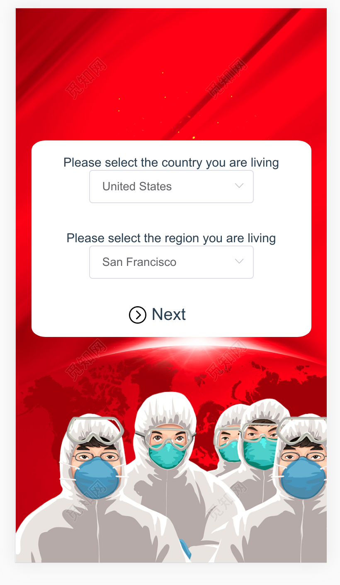
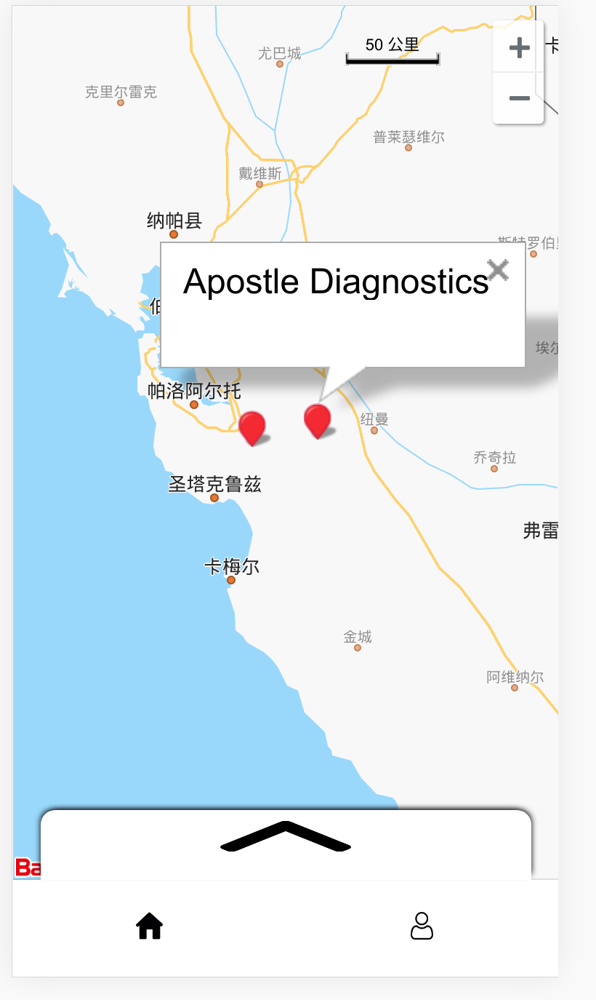
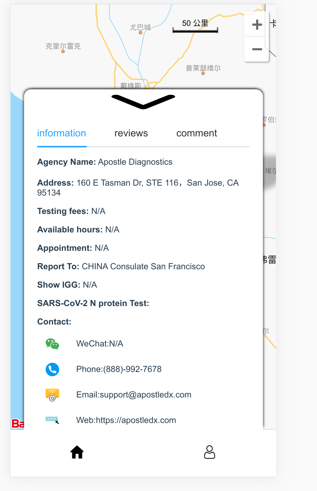
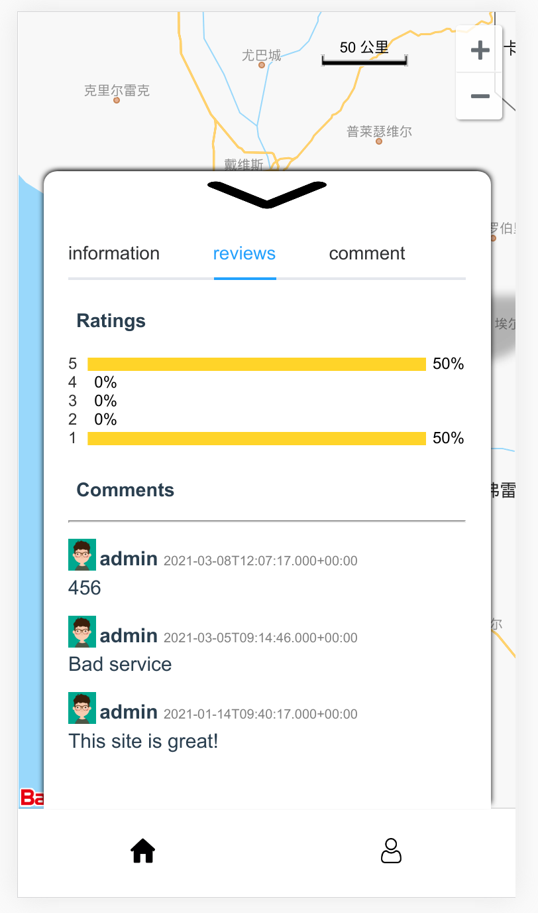
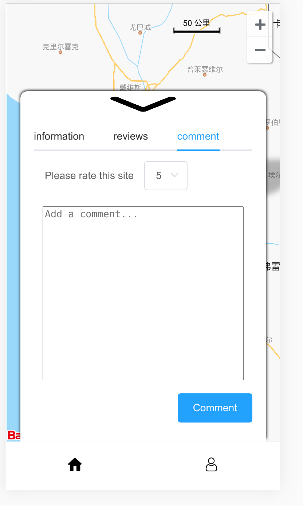
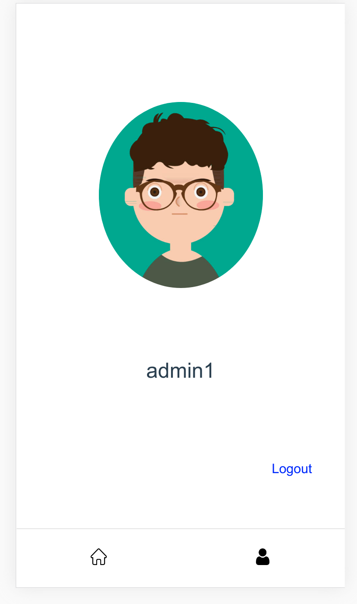

# back-home

> A Vue.js project

## Build Setup

### This project aims at providing testing sites information for passeagers planning to go to China during the pandemic. This project has implemented Information Display, Checking Comments and Adding Comments functions.

### Tech Stack:

FrontEnd: Vue, Vuex, echarts, element-ui
BackEnd: MyBatis-Plus,MySQL, SpringBoot.

### Pages Display:

#### Login and Signup:

#### Select Country and Region:

#### Check testing sites geolocations:

#### Check testing sites Details:

#### Check testing sites comments:

#### Add comments:

#### User profile:

